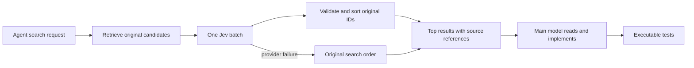

# Search with an optional Jev reranker

Status: experimental benchmark adapter, not an installed/default MCP feature.

Outcome: [the frozen screening did not meet either adoption gate](results/RESULTS.md).
Keep the following as an optional-search design, not an enabled default. The
[rounding follow-up](results/ROUNDING.md) also leaves a material quality gap.

## Product boundary

The intended tools are `search_code(query, scope, limit)` and `search_docs(query,
scope, limit)`. Their executor retrieves candidates, sends existing text to the
reranker, and returns original IDs/paths/snippets in ranked order. The main model
does not compose a second semantic representation or retype source text.

1. Search a permitted corpus with lexical/vector retrieval; preserve up to 30
   candidates and their original order.
2. Send one shared state `{query, candidates: [{id, text}]}` and one four-level
   Score question per candidate. A buggy implementation can be highly relevant
   to a repair request; current code correctness is not the ranking criterion.
3. Validate answer count, score range, probability distribution, resolved model,
   and expected score. Sort by expected level; keep original order on ties.
4. Return the top five with original source references. Keep remaining candidates
   available for expansion. Ranking does not establish irrelevance, truth,
   permission, or test success. No confidence threshold silently deletes sources.
5. Provider/validation failure returns the original search order and a visible
   fallback status. There is one attempt, no hidden retry.

The experimental adapter is `rank.mjs`. It rejects oversized inputs rather than
silently truncating; retrieval owns any explicit snippet budget. Code and docs
share this boundary, but this campaign directly tests code only. Production
indexing, MCP registration, context expansion, and host-specific installation are
not part of this experiment.

## Two evidence layers

### Public paired-function retrieval

Random 64 queries from the Python split of `mteb/CodeSearchNetRetrieval`.
Remove candidate docstrings/comments before indexing and ranking to avoid
query/docstring duplication. Freeze raw-data hashes, cleaning, seed and resulting
candidate lists before calls. Keep queries whose gold is absent from top30 in
the denominator; also report conditional metrics. A paired function is incomplete
relevance gold, so metrics are **paired-target retrieval**, not universal semantic
accuracy. Public-dataset training contamination cannot be excluded.

Arms share exact candidate text/order: BM25; Jev 30 Score questions in one call;
Fable low returning only top-five IDs in one call. Report top1, recall5, candidate
recall, rank wall/API time, main-model input/output, fallback counts. No agent
productivity claim from these metrics. The frozen ranking screen requires top1
gain >=10pp over BM25, recall5 no worse, top1 within 5pp of Fable, and rank wall
>=30% lower than Fable.

### Executable repair screen

Eight independently authored synthetic bug reports, 48 utility functions,
hidden unittest acceptance checks. Before live calls, verify each baseline
fails and each reference fix passes. The task author is separate from the
reranker/harness author. This is a small controlled screen, not real issue
resolution in production repositories.

Four arms: BM25 top5; Jev top5; Fable-reranked top5; direct original top30. All
use the same Fable low repair prompt and return one complete replacement
function. The executor restricts replacement to an offered ID and matching
symbol, copies the pristine fixture, and runs hidden tests. On macOS the test
subprocess denies network and filesystem writes; it gets no API-key environment.
Tests and reference fixes are never supplied to the repair model.
The macOS profile does not isolate filesystem reads. It is used only for this
authored fixture, not as a general sandbox for untrusted repository code.

Two repeats, randomized task/arm block order, serial native jobs, fresh sessions.
Repeat observations do not increase the independent task count. Count every
failure in its assigned arm; separately expose ranking fallback and model/schema
failures. Do not repair fixtures/prompts after measured outcomes. Report
retrieval, rank, repair, test and total times, all-attempt and shared-success
comparisons, usage, and observed models. Main/rank LLM sessions are separate to
avoid the ranker's full30 context leaking into the top5 repair arm; startup cost
is included and API timing is reported separately.

End-to-end gate: all Jev rank calls valid, no fewer test-passing repairs in
either repeat than direct top30 and LLM-reranked top5, and at least 20% lower
median total wall time than both. Against the cheap BM25 top5 arm, require
either at least two more solved tasks per repeat (quality benefit), or matching
repair counts per repeat with at least 20% lower median total wall (speed
benefit). This prevents a weak top5 baseline or an unnecessarily large full30
context from establishing a spurious install reason. Passing remains a screen,
not proof of general coding productivity. Input reduction is measured separately.

## Prior evidence

The external [jev-rerank-bench](https://github.com/anessbelbati/jev-rerank-bench)
motivates the hypothesis. Its original candidate-text condition differs from
our cleaned-code condition; its numbers are not our results. Our earlier
evidence-check and issue-router studies did not show reliable end-to-end gains.
They motivate testing efficient direct baselines and counting orchestration.
